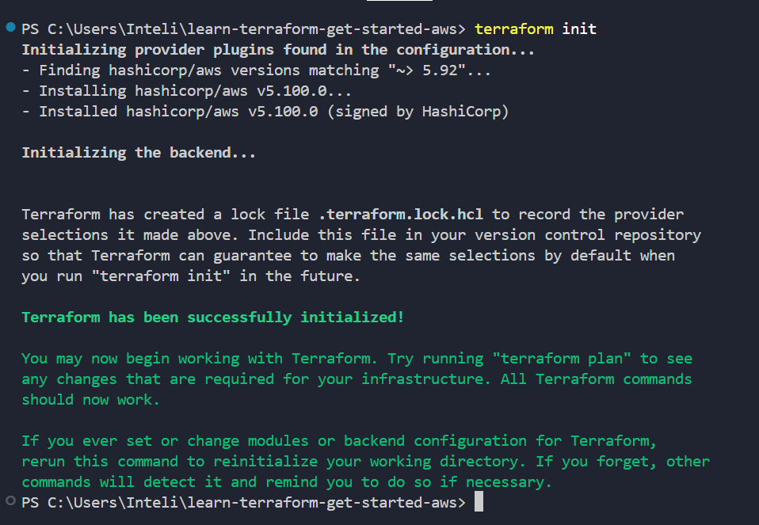
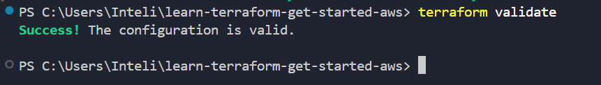
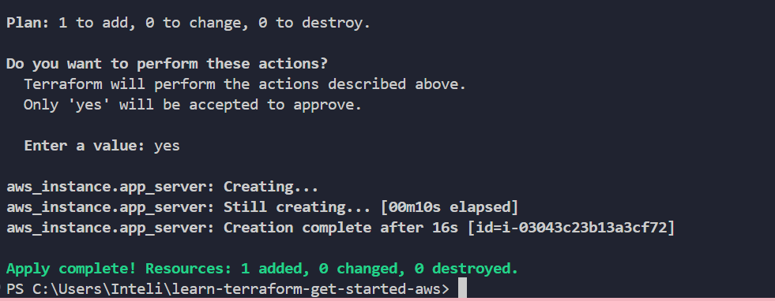
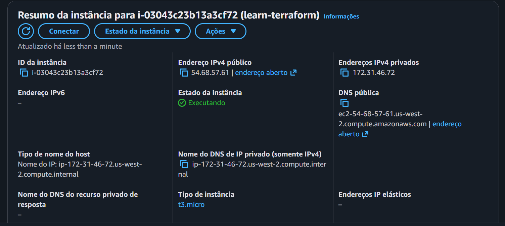

# ☁️ Provisionamento de Infraestrutura na AWS com Terraform

Este repositório reúne a documentação e os arquivos de configuração utilizados para provisionar automaticamente uma instância EC2 na AWS com o Terraform (IaC). O tutorial seguido como referência está disponível aqui: https://developer.hashicorp.com/terraform/tutorials/aws-get-started/aws-create

## 🛠️ Tecnologias Utilizadas

* **Terraform:** Ferramenta de IaC para construir, alterar e versionar infraestrutura de maneira segura e eficiente.
* **AWS (Amazon Web Services):** Provedor de computação em nuvem utilizado para hospedar a infraestrutura.
* **Ubuntu Server:** Sistema operacional Linux escolhido para a instância virtual.

## 📂 Arquivos do Projeto

* `main.tf`: Contém a definição do provedor AWS, a busca automatizada pela imagem do Ubuntu (AMI) e as especificações da instância EC2 (`t3.micro`).
* `terraform.tf`: Define os requisitos de versão do Terraform e dos provedores utilizados.

## 📸 Evidências do Processo (Passo a Passo)

Abaixo estão os registros visuais de cada etapa executada com sucesso no terminal e a validação final diretamente no painel da AWS:

### 1. Inicialização do Workspace
O comando `terraform init` foi executado para ler as configurações e baixar de forma automática o plugin oficial do provedor da AWS.


### 2. Validação Sintática do Código
O comando `terraform validate` foi utilizado para garantir que a estrutura dos arquivos `.tf` estava impecável e sem erros de escrita.


### 3. Aplicação e Provisionamento da Infraestrutura
Com o comando `terraform apply` e a devida aprovação (`yes`), o Terraform se conectou de forma segura às chaves de ambiente e realizou a criação do recurso na nuvem.


### 4. Evidência de Sucesso no Console AWS (EC2)
Mudando a região do console global da AWS para **Oeste dos EUA (Oregon) / us-west-2**, foi possível confirmar a instância `learn-terraform` ativa, ligada e rodando na camada gratuita.



## 🚨 Boas Práticas de Segurança e Custos

Após a coleta de todas as evidências visuais necessárias para o projeto, o comando abaixo foi executado no terminal para destruir completamente o recurso criado:

```
terraform destroy
```

## 🚀 Execução do Passo a Passo e Coleta de Evidências

O ciclo de vida do gerenciamento de configurações do Terraform foi executado via linha de comando no terminal. Abaixo constam as descrições objetivas, propósitos teóricos e os resultados obtidos em cada etapa.

### Passo 1: Inicialização do Diretório (terraform init)

- Propósito: Analisar o código local, identificar os provedores declarados e inicializar o ecossistema local. O comando faz o download do binário do plugin do provedor AWS (v5.100.0) e cria os diretórios internos de controle do backend.

- Resultado Obtido: O terminal confirmou que o ambiente local foi configurado com êxito e criou o arquivo de trava de versão .terraform.lock.hcl.

```
terraform init
```


### Passo 2: Validação Sintática e Semântica (terraform validate)

- Propósito: Realizar uma análise estática preventiva em todos os arquivos .tf do diretório. O comando checa se existem erros de digitação, argumentos inválidos, variáveis não declaradas ou blocos mal fechados antes de efetuar qualquer chamada externa.
- Resultado Obtido: Retorno com sucesso absoluto, assegurando que a configuração declarada está estruturalmente perfeita para execução.

```
terraform validate
```


### Passo 3: Aplicação do Plano de Mudanças (terraform apply)

- Propósito: Criar o plano de execução comparando o estado desejado do código com o estado atual da nuvem (gerando uma saída incremental). Após a validação visual do operador e inserção do comando de confirmação explícita (yes), as chamadas de API são efetuadas para instanciar a máquina virtual.
- Resultado Obtido: Processamento concluído em 16 segundos, gerando a inclusão bem-sucedida do recurso e gerando o arquivo de controle local terraform.tfstate.

```
terraform apply
```


## 🖥️ Documentação e Auditoria dos Itens Provisionados na Nuvem

Esta seção é dedicada à auditoria do recurso provisionado, servindo como comprovação física de que o Terraform alterou o estado real do provedor de nuvem de forma correta.

**Especificações Técnicas do Recurso Identificado:**
Ao acessar o painel de gerenciamento do serviço EC2 (Elastic Compute Cloud) no Console Web da AWS, e alterando o escopo regional estritamente para Oeste dos EUA (Oregon) / us-west-2, a máquina virtual foi identificada com os seguintes metadados auditados:

- ID da Instância: i-03043c23b13a3cf72 (Correspondente integral ao ID retornado no terminal local)
- Nome da Tag (Name): learn-terraform
- Estado do Recurso: Executando / Running
- Tipo Físico de Instância: t3.micro
- Arquitetura de Rede Privada Interna: Subnet e VPC padrões mapeadas nativamente (172.31.46.72)

